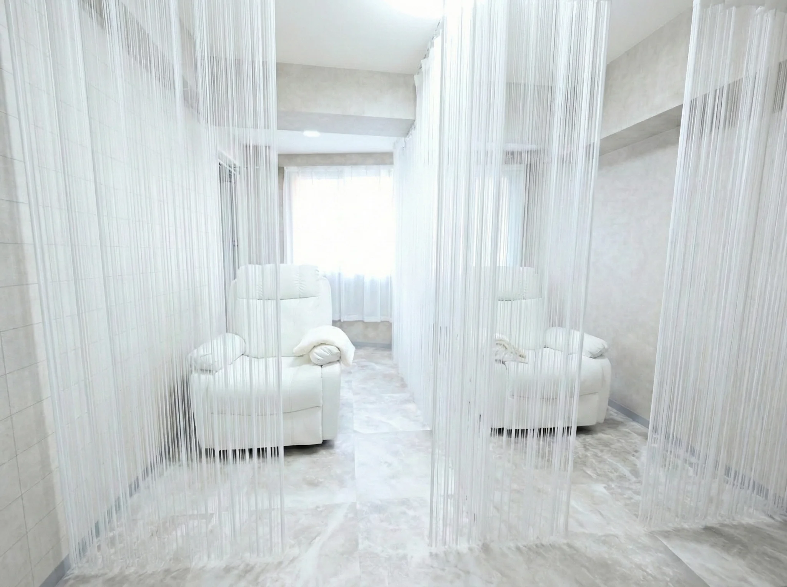

# 画像・動画 配置ガイド

このサイトに必要な画像と動画のガイドです。

---

## サイト構成と画像配置場所

```
┌─────────────────────────────────────────────────────────┐
│  milbon関係者様限定 特別優待サイト（金色バナー）           │
├─────────────────────────────────────────────────────────┤
│                                                         │
│   ┌─────────────────────────────────────────────────┐   │
│   │                                                 │   │
│   │     【1】hero-video.mp4 / hero-poster.webp       │   │
│   │         ヒーロー背景（全画面動画）                │   │
│   │         1920x1080px / 15-30秒ループ              │   │
│   │                                                 │   │
│   │         「美のプロだからこそ、最高の目元を。」     │   │
│   │                                                 │   │
│   └─────────────────────────────────────────────────┘   │
│                                                         │
├─────────────────────────────────────────────────────────┤
│  Concept セクション                                      │
│                                                         │
│   ┌──────────────┐                                      │
│   │【2】          │    「美を届けるあなたへ、          │
│   │concept-1.webp │     特別な美を。」                  │
│   │施術シーン     │                                     │
│   │800x1000px    │     日々、お客様の美しさを...       │
│   │   ┌─────────┐│                                     │
│   │   │【3】    ││                                     │
│   │   │concept- ││                                     │
│   │   │2.webp    ││                                     │
│   │   │内観     ││                                     │
│   │   │600x400  ││                                     │
│   │   └─────────┘│                                     │
│   └──────────────┘                                      │
│                                                         │
├─────────────────────────────────────────────────────────┤
│  Features セクション（画像なし・アイコンのみ）           │
├─────────────────────────────────────────────────────────┤
│                                                         │
│   ┌─────────────────────────────────────────────────┐   │
│   │                                                 │   │
│   │     【4】visual-break.webp                       │   │
│   │         目元クローズアップ（横長ワイド）          │   │
│   │         1600x600px                              │   │
│   │                                                 │   │
│   │            "目元が変わると、人生が変わる。"      │   │
│   │                                                 │   │
│   └─────────────────────────────────────────────────┘   │
│                                                         │
├─────────────────────────────────────────────────────────┤
│  Menu セクション（画像なし・テキストのみ）               │
├─────────────────────────────────────────────────────────┤
│  Gallery セクション                                      │
│                                                         │
│   ┌────────────┬────────────┬────────────┐             │
│   │【5】       │【6】       │【7】       │             │
│   │gallery-1   │gallery-2   │gallery-3   │             │
│   │パリジェンヌ│眉毛WAX     │ハリウッド  │             │
│   │600x800(大) │400x400     │ブロウ      │             │
│   │            ├────────────┼────────────┤             │
│   │            │【8】       │【9】       │             │
│   │            │gallery-4   │gallery-5   │             │
│   │            │セット      │メンズ      │             │
│   │            │400x400     │400x400     │             │
│   │            ├────────────┴────────────┤             │
│   │            │【10】gallery-video.mp4  │             │
│   │            │施術動画 30-60秒          │             │
│   └────────────┴─────────────────────────┘             │
│                                                         │
├─────────────────────────────────────────────────────────┤
│  Testimonials セクション（画像なし）                     │
├─────────────────────────────────────────────────────────┤
│  Access セクション                                       │
│                                                         │
│   店舗情報           │  ┌─────────────────┐            │
│   ・店舗名           │  │【11】            │            │
│   ・住所             │  │Google Map埋込    │            │
│   ・営業時間         │  │                  │            │
│   ・ご予約           │  └─────────────────┘            │
│                                                         │
├─────────────────────────────────────────────────────────┤
│                                                         │
│   ┌─────────────────────────────────────────────────┐   │
│   │                                                 │   │
│   │     【12】cta-bg.webp                            │   │
│   │         最終CTA背景（暗めトーン）                 │   │
│   │         1920x1080px                             │   │
│   │                                                 │   │
│   │         「美を届けるあなたに、最高の美を。」      │   │
│   │                                                 │   │
│   └─────────────────────────────────────────────────┘   │
│                                                         │
├─────────────────────────────────────────────────────────┤
│  Footer                                                 │
└─────────────────────────────────────────────────────────┘
```

---

## 必要なファイル一覧（アスペクト比付き）

### 📁 images/ フォルダに入れる画像

| No. | ファイル名 | 内容 | サイズ | アスペクト比 |
|-----|-----------|------|--------|-------------|
| 1 | `hero-poster.webp` | 動画が読み込まれる前に表示される静止画 | 1920x1080px | **16:9（横長）** |
| 2 | `concept-1.webp` | 施術シーン（眉毛デザイン中の手元） | 800x1000px | **4:5（縦長）** |
| 3 | `concept-2.webp` | サロン内観（半個室の雰囲気） | 600x400px | **3:2（横長）** |
| 4 | `visual-break.webp` | 施術後の目元クローズアップ | 1600x600px | **8:3（超横長）** |
| 5 | `gallery-1.webp` | パリジェンヌ Before/After | 600x800px | **3:4（縦長）** |
| 6 | `gallery-2.webp` | 眉毛WAX Before/After | 400x400px | **1:1（正方形）** |
| 7 | `gallery-3.webp` | ハリウッドブロウリフト 仕上がり | 400x400px | **1:1（正方形）** |
| 8 | `gallery-4.webp` | セットメニュー Before/After | 400x400px | **1:1（正方形）** |
| 9 | `gallery-5.webp` | メンズ眉毛 Before/After | 400x400px | **1:1（正方形）** |
| 12 | `cta-bg.webp` | 最終CTA背景（暗め・抽象的） | 1920x1080px | **16:9（横長）** |

### 📁 assets/ フォルダに入れる動画

| No. | ファイル名 | 内容 | 長さ | アスペクト比 |
|-----|-----------|------|------|-------------|
| 1 | `hero-video.mp4` | 施術シーンのスローモーション | 15-30秒ループ | **16:9（横長）** |
| 10 | `gallery-video.mp4` | 施術ダイジェスト | 30-60秒 | **16:9 または 9:16（縦動画）** |

---

## アスペクト比 早見表

```
┌─────────────────────────────────────────────────────────────────┐
│                      アスペクト比の視覚ガイド                    │
├─────────────────────────────────────────────────────────────────┤
│                                                                 │
│  【16:9】横長（ワイド）                                          │
│  ┌─────────────────────────────┐                                │
│  │                             │  hero-poster.webp              │
│  │                             │  hero-video.mp4               │
│  │                             │  cta-bg.webp                   │
│  └─────────────────────────────┘                                │
│                                                                 │
│  【8:3】超横長（シネマティック）                                  │
│  ┌─────────────────────────────────────┐                        │
│  │                                     │  visual-break.webp     │
│  └─────────────────────────────────────┘                        │
│                                                                 │
│  【3:2】横長（標準カメラ）                                        │
│  ┌───────────────┐                                              │
│  │               │  concept-2.webp                              │
│  │               │                                              │
│  └───────────────┘                                              │
│                                                                 │
│  【1:1】正方形（Instagram向き）                                   │
│  ┌─────────┐                                                    │
│  │         │  gallery-2.webp                                    │
│  │         │  gallery-3.webp                                    │
│  │         │  gallery-4.webp                                    │
│  │         │  gallery-5.webp                                    │
│  └─────────┘                                                    │
│                                                                 │
│  【4:5】縦長（ポートレート）                                      │
│  ┌───────┐                                                      │
│  │       │                                                      │
│  │       │  concept-1.webp                                      │
│  │       │                                                      │
│  └───────┘                                                      │
│                                                                 │
│  【3:4】縦長（ポートレート）                                      │
│  ┌───────┐                                                      │
│  │       │                                                      │
│  │       │  gallery-1.webp                                      │
│  │       │                                                      │
│  │       │                                                      │
│  └───────┘                                                      │
│                                                                 │
└─────────────────────────────────────────────────────────────────┘
```

---

## 各画像の詳細仕様

### 1. hero-poster.webp / hero-video.mp4
- **アスペクト比**: 16:9
- **推奨サイズ**: 1920 x 1080 px
- **用途**: ファーストビュー全画面背景
- **ポイント**: 暗めのトーンで文字が読みやすいもの

### 2. concept-1.webp
- **アスペクト比**: 4:5（縦長）
- **推奨サイズ**: 800 x 1000 px
- **用途**: コンセプトセクションのメイン画像
- **ポイント**: 施術中の手元、プロフェッショナル感

### 3. concept-2.webp
- **アスペクト比**: 3:2（横長）
- **推奨サイズ**: 600 x 400 px
- **用途**: コンセプトセクションのサブ画像
- **ポイント**: サロン内観、半個室の雰囲気

### 4. visual-break.webp
- **アスペクト比**: 8:3（超横長/シネマティック）
- **推奨サイズ**: 1600 x 600 px
- **用途**: セクション間のビジュアルブレイク
- **ポイント**: 目元のクローズアップ、印象的な一枚

### 5. gallery-1.webp
- **アスペクト比**: 3:4（縦長）
- **推奨サイズ**: 600 x 800 px
- **用途**: ギャラリー大サイズ画像
- **ポイント**: パリジェンヌラッシュリフト Before/After

### 6-9. gallery-2.webp ～ gallery-5.webp
- **アスペクト比**: 1:1（正方形）
- **推奨サイズ**: 400 x 400 px
- **用途**: ギャラリーグリッド画像
- **ポイント**: 各メニューの Before/After

### 10. gallery-video.mp4
- **アスペクト比**: 16:9（横長）または 9:16（縦長/スマホ撮影）
- **推奨サイズ**: 1920 x 1080 px または 1080 x 1920 px
- **長さ**: 30-60秒
- **用途**: ギャラリー内の施術動画
- **ポイント**: 施術の流れがわかるダイジェスト

### 12. cta-bg.webp
- **アスペクト比**: 16:9
- **推奨サイズ**: 1920 x 1080 px
- **用途**: 最終CTAセクションの背景
- **ポイント**: 暗めで抽象的、文字が映えるもの

---

## 画像の入れ方（手順）

### ステップ1: 画像ファイルを準備
上記の名前で画像を用意してください。

### ステップ2: フォルダに配置
```
milbon/
├── images/          ← ここに画像を入れる
│   ├── hero-poster.webp
│   ├── concept-1.webp
│   ├── concept-2.webp
│   ├── visual-break.webp
│   ├── gallery-1.webp
│   ├── gallery-2.webp
│   ├── gallery-3.webp
│   ├── gallery-4.webp
│   ├── gallery-5.webp
│   └── cta-bg.webp
├── assets/          ← ここに動画を入れる
│   ├── hero-video.mp4
│   └── gallery-video.mp4
├── css/
├── js/
└── index.html
```

### ステップ3: HTMLを編集
各画像の場所で、プレースホルダーを実際の画像に置き換えます。

**変更前:**
```html
<div class="image-placeholder" data-text="【concept-1.webp】...">
    <!--  -->
</div>
```

**変更後:**
```html

```

---

## Google Map の埋め込み方

1. Google Maps で「蒲田駅」を検索
2. 「共有」ボタンをクリック
3. 「地図を埋め込む」タブを選択
4. 「HTMLをコピー」をクリック
5. index.html の該当箇所に貼り付け

```html
<!-- 変更前 -->
<div class="map-placeholder" data-text="【Google Map】...">
    <!-- <iframe src="..."></iframe> -->
</div>

<!-- 変更後 -->
<iframe src="https://www.google.com/maps/embed?pb=..."
        width="100%"
        height="400"
        style="border:0;"
        allowfullscreen=""
        loading="lazy">
</iframe>
```

---

## 画像の撮影・選定ポイント

### 全体のトーン
- **色調**: パープル・ゴールド系の補正を統一
- **照明**: 自然光または間接照明（蛍光灯NG）
- **雰囲気**: 高級感・清潔感・プロフェッショナル感

### Before/After 写真
- 同じ角度・同じ照明で撮影
- 左右分割または上下分割
- 変化がわかりやすいもの

### 施術シーン
- 施術者の手元がきれいに映っているもの
- お客様の顔は横顔または目元のみ
- 清潔感のある服装・空間
